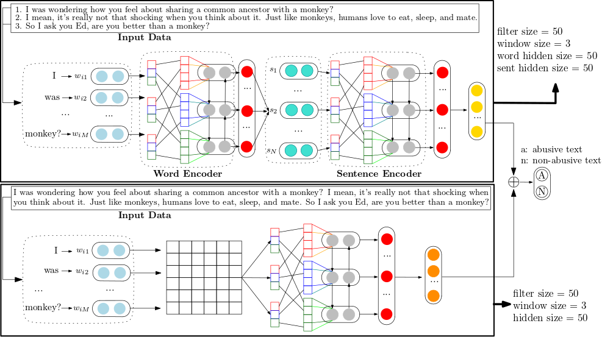

### Detecting context abusiveness using hierarchical deep learning

    Abusive text is a serious problem in social media and causes many issues among users as the number of users and the content volume increase. There are several attempts for detecting or preventing abusive text effectively. One simple yet effective approach is to use an abusive lexicon and determine the existence of
    an abusive word in text. This approach works well even when an abusive word is obfuscated. On the other hand, it is still a challenging problem to determine abusiveness in a text having no explicit abusive words. Especially, it is hard to identify sarcasm or offensiveness in context without any abusive words. We tackle this problem using an ensemble deep learning model. Our model consists of two parts of extracting local features and global features, which are crucial for identifying implicit abusiveness in context level. We evaluate our model using three benchmark data. Our model outperforms all the previous models for detecting abusiveness in a text data without abusive words. Furthermore, we combine our model and an abusive lexicon method. The experimental results show that our model has at least 4% better performance compared with the previous approaches for identifying text abusiveness in case of with/without abusive words

Read paper [here](https://www.aclweb.org/anthology/D19-5002.pdf)

### Requirements

    python >= 3.0
    pyTorch >= 1.0.0
    scipy >= 1.4.1
    gensim >= 3.8.0

### Download Glove

Please download `crawl-300d-2M-subword.zip` on https://nlp.stanford.edu/projects/glove/

### Download data

Please download `Toxic Comment Classification Challenge data` on https://www.kaggle.com/c/jigsaw-toxic-comment-classification-challenge

### Usage

modify the config file, see the Config directory([here](https://github.com/HiitLee/Detecting context abusiveness using hierarchical deep learning/tree/master/Config)) for detail.  

    $python main.py --mode [train, eval] --model [HCL,HCL_CLSTM,HCL_CLSTM_CLSTM]

### train and evaluation

We used  GTX 1080 Ti GPU for model training.

During training, we output the accuracy of test set after each epoch.

## Question ##

- if you have any question, you can open a issue or email **juhyounglee@{yonsei.ac.kr}**.
